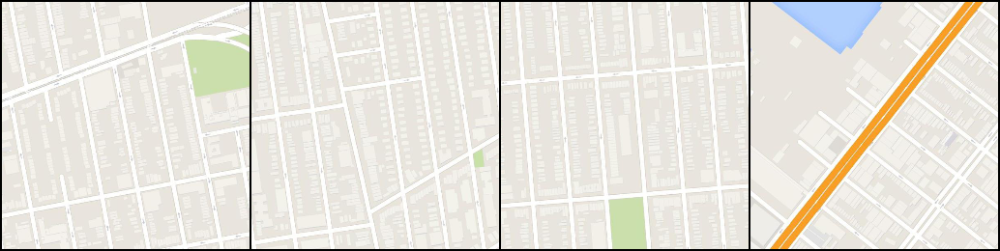
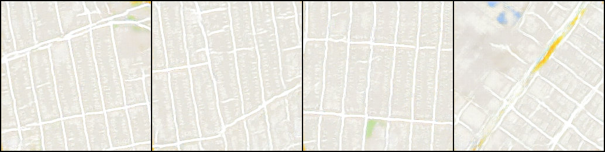
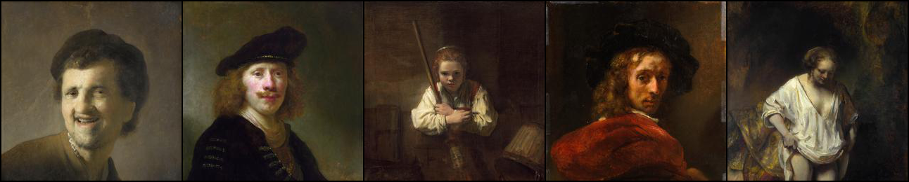
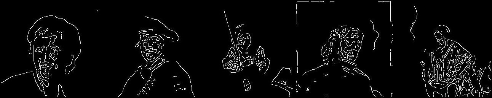
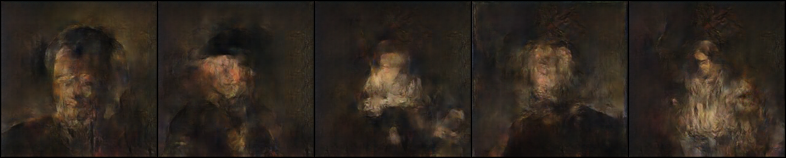

# GAN_PROJECT_Pix2Pix
Project for DLS

Реализация преобразования изображения в изображение (pix2pix) с помощью условных состязательных сетей и библиотеки PyTorch

## Maps dataset
* Image is resized to 256x256 image (Original size: 600x600)
* Number of training images: 1,096
* Number of test images: 1,098
### Maps dataset
The dataset can be downloaded from Kaggle: [link](https://www.kaggle.com/vikramtiwari/pix2pix-dataset).

Pretrained Generator for Maps https://drive.google.com/file/d/19gJx8VwLwulEM1JreUDRhAaTTk4X7_oV/view?usp=sharing
### Results
* Adam optimizer is used. Learning rate = 0.0002, batch size = 4, # of epochs = 200 (из-за ограниченности по времени, для полной имплементации требуется batch size = 1)
* Generated images using test data

    |1st row: Label / 2nd row: Input / 3rd column: Generated|
    |:---:|
    ||
    ||
    ||

## Rembrandt dataset
* Image size is 256x256
* Number of training images: 240
* Number of test images: 60
### Rembrandt dataset
The dataset can be downloaded from Kaggle: [link](https://www.kaggle.com/grafstor/rembrandt-pix2pix-dataset?select=generator_a.h5).

Pretrained Generator for Rembrandt https://drive.google.com/file/d/1FNLB_8vBTvANxYZmb7eVyVXMgeDNUIXZ/view?usp=sharing
### Results
* Adam optimizer is used. Learning rate = 0.0002, batch size = 1, # of epochs = 250
* Generated images using test data

    |1st row: Label / 2nd row: Input / 3rd column: Generated|
    |:---:|
    ||
    ||
    ||
    
    #### Замечания по выполненной проектной работе:
    Проект состоит из двух частей:
   1. Имплементация статьи по pix2pix https://arxiv.org/pdf/1611.07004.pdf
   2. Работа с датасетом по Рембрандту. Попытка представитть, как выглядел бы импрессионизм, если бы бы Рембрандт стал его родоначальником за 200 с лишним лет до его реального появления. В качестве входных данных использутся гравюры, а в качестве выходных данных сами картины великого мастера
   
Предобработка данных по обоим датасетам находится в папке data

    Готовые результаты вынесены в папку image и в README.md.
Модель генератора и дискриминатора описана в папке model.
В папке train находится обучающий модуль.
По рекомендации куратора использовал в обучающем модуле argparse, но потом закомментировал его, т.к. данный модуль запускался из JUPYTER.
Так как на github не заливаются файлы более 25м, - на обученные генераторы дал ссылки.
    Во время работы иногда воспользовывался идеями Aladdin Persson, ссылка на его реализацию: https://github.com/aladdinpersson/Machine-Learning-Collection/tree/master/ML/Pytorch/GANs/Pix2Pix
