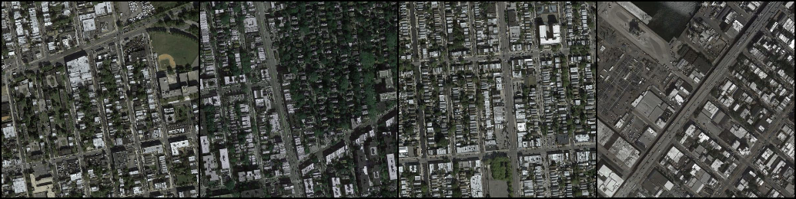

# GAN_PROJECT_Pix2Pix
Project for DLS

Реализация преобразования изображения в изображение (pix2pix) с помощью условных состязательных сетей и библиотеки PyTorch

## Maps dataset
* Image is resized to 256x256 image (Original size: 600x600)
* Number of training images: 1,096
* Number of test images: 1,098
### Maps dataset
The dataset can be downloaded from Kaggle: [link](https://www.kaggle.com/vikramtiwari/pix2pix-dataset).
### Results
* Adam optimizer is used. Learning rate = 0.0002, batch size = 4, # of epochs = 200 (из-за ограниченности по времени, для полной имплементации требуется batch size = 1)
* Generated images using test data

    |1st row: Label / 2nd row: Input / 3rd column: Generated|
    |:---:|
    ||
    ||
    ||

## Rembrandt dataset
* Image size is 256x256
* Number of training images: 240
* Number of test images: 60
### Rembrandt dataset
The dataset can be downloaded from Kaggle: [link](https://www.kaggle.com/grafstor/rembrandt-pix2pix-dataset?select=generator_a.h5).
### Results
* Adam optimizer is used. Learning rate = 0.0002, batch size = 1, # of epochs = 250
* Generated images using test data

    |1st row: Label / 2nd row: Input / 3rd column: Generated|
    |:---:|
    ||
    ||
    ||
